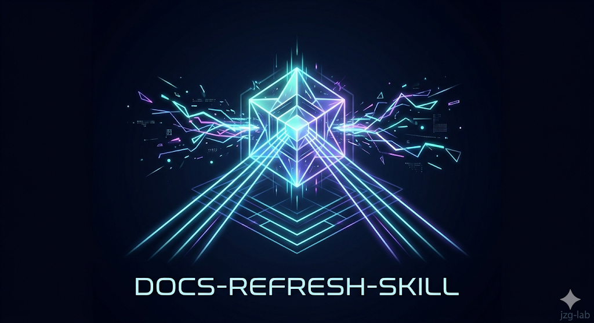
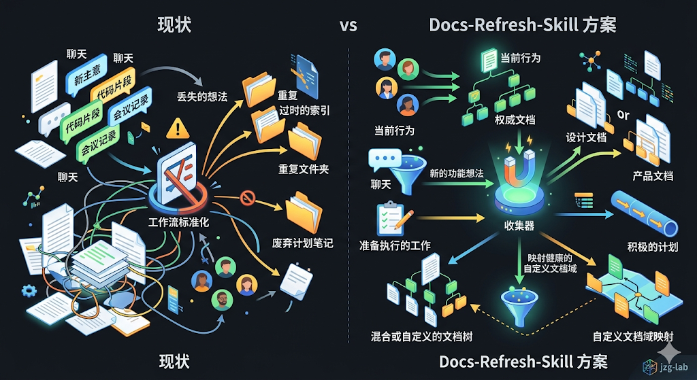

# Docs Refresh
---

`docs-refresh` is a reusable workflow for documentation-driven, agent-first development.

It helps an agent keep your repo's docs system usable while the project is moving fast: current behavior goes back into authoritative docs, new feature ideas get routed into the right design or product docs, execution-ready work becomes an active plan instead of getting lost in chat, and mixed or custom docs trees get mapped before the workflow tries to normalize them.

This project is inspired by OpenAI's Harness Engineering approach(https://openai.com/zh-Hans-CN/index/harness-engineering/): keep the repository as the record system, keep `AGENTS.md` short and navigational, and make plans and docs first-class engineering artifacts.

Use it when you need to:

- sync docs after code changes
- turn scattered docs into a clean, navigable docs system
- add a new feature and decide whether it belongs in product/design docs or `docs/exec-plans/active/`
- repair stale indexes, broken authority pointers, or drifting doc structure
- keep `PRODUCT_SENSE.md`, `DESIGN.md`, `FRONTEND.md`, `PLANS.md`, `QUALITY_SCORE.md`, `RELIABILITY.md`, and `SECURITY.md` actually useful as the repo grows

The core workflow lives in plain Markdown at `docs-refresh/SKILL.md`, so it can be adapted to any agent or prompt system that can reuse structured instructions.

## Why Docs Refresh

- Agents stop dumping everything into one giant `AGENTS.md` or random markdown files.
- New work lands in the right place: current truth in authoritative docs, fuzzy ideas in product/design docs, execution-ready work in `docs/exec-plans/active/`.
- Your existing docs system stays usable as the repo grows instead of drifting into stale indexes, duplicate folders, and abandoned planning notes, because the collector maps healthy custom docs domains before recommending normalization.

## Installation

This repository currently ships a reusable skill folder, not a host-native plugin package.

Current distribution paths:

- manual installation into a local skills directory
- downloading the published ClawHub bundle and unpacking it into a local skills directory
- manual installation into OpenCode's native global or project-local skills directories
- ChatGPT/OpenAI skill upload or sharing flows
- direct reuse of `docs-refresh/SKILL.md` in any agent stack that can consume prompt/skill folders

It does **not** currently ship a Claude marketplace package, Cursor marketplace package, Gemini extension, Copilot plugin wrapper, or OpenCode plugin package.

### ClawHub

A packaged bundle is also published on [ClawHub](https://clawhub.ai/jzg-lab/docs-refresh).

Use **Download zip**, then extract the archive into a `docs-refresh/` folder inside your host's local skills directory.

The archive contains the skill contents at the top level (`SKILL.md`, `modes/`, `scripts/`, `agents/`), so create the `docs-refresh/` folder yourself if your host expects named skill directories.

After extraction, use the same target locations documented below for Codex or OpenCode.

### Codex

Install the `docs-refresh/` folder into Codex's local skills directory:

```bash
git clone https://github.com/jzg-lab/Docs-Refresh-Skill.git
mkdir -p "${CODEX_HOME:-$HOME/.codex}/skills"
cp -R Docs-Refresh-Skill/docs-refresh "${CODEX_HOME:-$HOME/.codex}/skills/"
```

If you already have an older `docs-refresh` install, replace that folder before copying the new one.

If you want Codex to do the install for you, tell it:

```text
Fetch and follow instructions from https://raw.githubusercontent.com/jzg-lab/Docs-Refresh-Skill/main/.codex/INSTALL.md
```

### OpenCode

Install `docs-refresh/` into one of OpenCode's native skill locations.

Global install:

```bash
git clone https://github.com/jzg-lab/Docs-Refresh-Skill.git
mkdir -p ~/.config/opencode/skills
cp -R Docs-Refresh-Skill/docs-refresh ~/.config/opencode/skills/
```

Project-local install:

```bash
git clone https://github.com/jzg-lab/Docs-Refresh-Skill.git
mkdir -p .opencode/skills
cp -R Docs-Refresh-Skill/docs-refresh .opencode/skills/
```

If you want OpenCode to do the install for you, tell it:

```text
Fetch and follow instructions from https://raw.githubusercontent.com/jzg-lab/Docs-Refresh-Skill/main/.opencode/INSTALL.md
```

## Updating

After the first install, the simplest upgrade path is to tell your tool to refresh the installed `docs-refresh` copy using this repository as the upstream source.

Suggested prompt:

```text
Update the installed docs-refresh skill from https://github.com/jzg-lab/Docs-Refresh-Skill and replace the local docs-refresh folder in the skills directory.
```

If the tool cannot do that directly, fall back to the install instructions and replace the existing `docs-refresh/` folder with a fresh copy.

### ChatGPT Skills

Use the Skills UI upload flow for this skill from your computer, then install or share it inside your workspace using your plan's available skills controls.

### Other Agent Stacks

If the host can reuse structured prompt/skill folders, point it at `docs-refresh/SKILL.md` and keep the bundled `docs-refresh/modes/` and `docs-refresh/scripts/` files with it.

## Portable Use

Use `docs-refresh/SKILL.md` as the canonical workflow instructions in your own agent stack.

If shell execution is available, also provide `docs-refresh/scripts/collect_changed_context.sh` so the workflow can gather consistent git context before deciding whether docs need to change.

The workflow is routed: it tries the bundled collector from the skill directory first, reads collector output when available, loads one matching mode file from `docs-refresh/modes/`, and falls back to manual routing when the collector cannot run. Do not assume the target repository contains its own `scripts/collect_changed_context.sh`.

## Optional OpenAI/Codex Adapter

This repository also includes an optional OpenAI-compatible adapter under `docs-refresh/agents/openai.yaml`.

That file is UI metadata for OpenAI-compatible surfaces. It is not, by itself, a marketplace package or installer.

## Use

Invoke the workflow however your host platform exposes reusable prompts or skills. In OpenAI/Codex-compatible surfaces, the packaged aliases can be wired to names such as `$docs-refresh` or `/docs-refresh`.

At a high level, the workflow will:

- classify the request as current-state refresh, future-spec refinement, or actionable execution planning
- read repository guidance first
- try the bundled diff collector first
- fall back to manual routing if the bundled collector is unavailable
- inspect only the code, schema, generated artifacts, and docs needed to confirm behavior or real planning constraints
- pressure-test problem frame, system boundaries, decisions, contracts, and validation before inventing more structure
- update the fewest authoritative docs possible
- keep execution-ready future work in `docs/exec-plans/active/` and move completed plans into `docs/exec-plans/completed/`
- reuse healthy custom docs domains when their role is clear, and normalize only when drift or planning needs force it
- stop after explaining what changed or why no doc update was needed

It will not stage, commit, or clean up git state automatically.

## Modes

- `bootstrap`: new or under-documented repos that need a minimal map and living overview before any deeper taxonomy exists
- `minimal`: repos with core docs such as `AGENTS.md`, `ARCHITECTURE.md`, or cross-cutting top-level docs, but no split docs tree yet
- `structured`: repos that already have split doc domains, whether standard, custom-mapped, or mixed, and should preserve the usable taxonomy
- `repair`: repos whose docs system exists but whose navigation or authority surfaces are stale enough to fix first

Missing `AGENTS.md` alone does not imply `repair`. Sparse docs usually mean `bootstrap` or `minimal`. New repositories should grow in phases instead of generating a full docs tree on first contact.

## Foundation Phases

- `framing`: clarify the problem frame, success criteria, and map before adding more structure
- `design`: make system boundaries, invariants, and key decisions explicit
- `contracts`: tighten API, schema, generated, or provider-facing reference docs
- `operations`: close validation, rollout, risk, scorecard, and navigation drift inside the existing doc system

This means the workflow does not treat PRD, SRS, architecture docs, or ADRs as mandatory filenames. It treats them as durable documentation responsibilities that may live in different files depending on repository maturity.

## Repository Layout

- `.codex/INSTALL.md`: Codex-specific install instructions
- `.opencode/INSTALL.md`: OpenCode-specific install instructions
- `docs-refresh/SKILL.md`: authoritative skill instructions
- `docs-refresh/modes/`: routed workflow branches selected by the collector
- `docs-refresh/references/`: shared reference artifacts such as the foundation checklist
- `docs-refresh/scripts/collect_changed_context.sh`: diff/context collector
- `docs-refresh/scripts/scaffold_exec_plans.sh`: bundled helper that creates the default `docs/exec-plans/` scaffold without overwriting existing plan docs
- `docs-refresh/scripts/test_collect_changed_context_routing.sh`: shell smoke test for collector routing
- `docs-refresh/scripts/test_scaffold_exec_plans.sh`: shell smoke test for the exec-plans scaffold helper
- `docs-refresh/scripts/test_skill_fallback_contract.sh`: shell smoke test for collector fallback and manual routing guidance
- `docs-refresh/agents/openai.yaml`: optional adapter metadata for OpenAI-compatible surfaces
- `AGENTS.md`: repository navigation for agents
